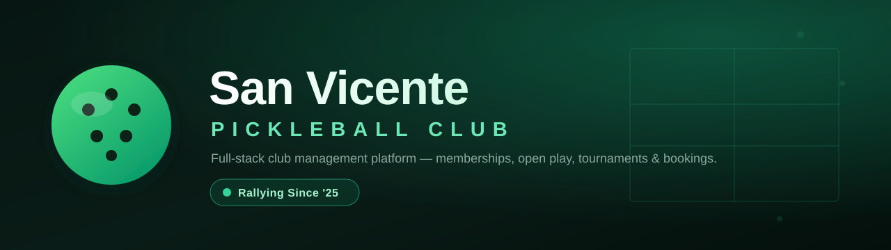
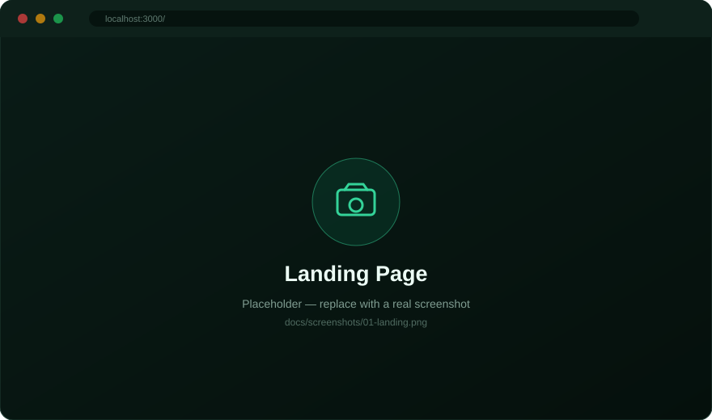
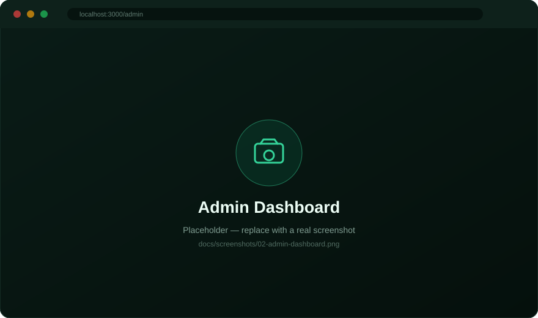
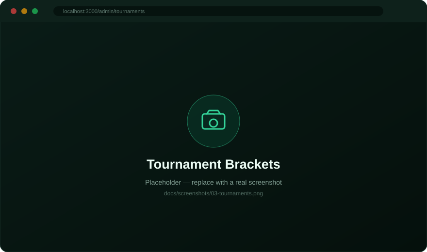
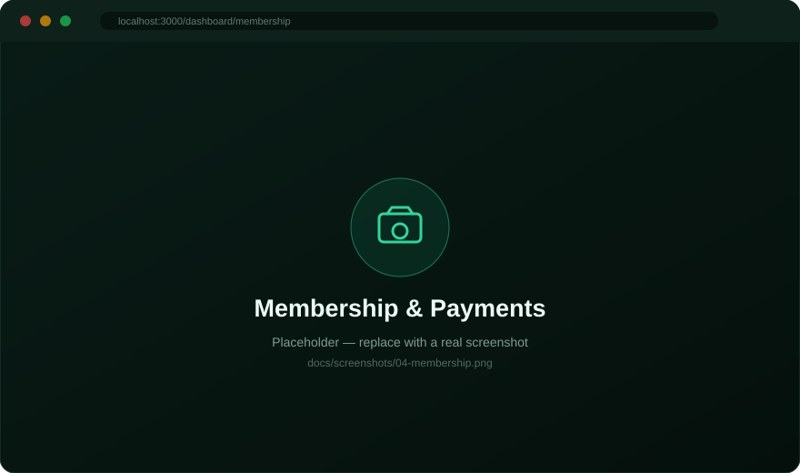
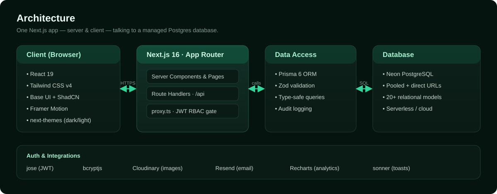

<p align="center">
  
</p>

<p align="center">
  <b>San Vicente Pickleball Club (SVPC)</b> — a full-stack club management platform.<br>
  Memberships · Payments · Open Play · Tournaments with auto-brackets · Court Bookings · RBAC admin.
</p>

<p align="center">
  
  
  
  
  
  
  
</p>

---

## Overview

SVPC is a production-style SaaS for running a pickleball club end to end. Members apply
online, pay via GCash/bank transfer (with manual proof verification), join open-play
sessions, book courts, and enter tournaments whose brackets are generated automatically.
Staff and admins manage everything from a role-gated dashboard with analytics.

Built as a **single full-stack Next.js app** (App Router) — no separate backend — backed by
PostgreSQL on Neon.

## Table of Contents

- [Features](#features)
- [Screenshots](#screenshots)
- [Architecture](#architecture)
- [Tech Stack](#tech-stack)
- [Getting Started](#getting-started)
- [Environment Variables](#environment-variables)
- [Roles &amp; Demo Accounts](#roles--demo-accounts)
- [Project Structure](#project-structure)
- [Scripts](#scripts)
- [Deployment](#deployment)
- [Roadmap](#roadmap)
- [License](#license)

## Features

**Public site**
- 🏠 Landing page, events, tournaments, open-play and announcements — all public.
- 📝 Full membership application form (personal, emergency, playing & payment details).

**Members**
- 💳 Membership card with status, tier and expiry; upload payment proof.
- 🎾 Join / cancel open-play sessions with automatic waitlist promotion.
- 📅 Request court bookings; track approval, court, price and invoice.
- 🏆 View tournaments, brackets and standings.
- 🔔 In-app notifications, leaderboard, profile and announcements.

**Admin & Staff**
- 📊 Dashboard with live stats and Recharts analytics.
- ✅ Approve / reject / request-info on pending membership applications (auto-generates a membership number).
- 👥 Member management (create walk-ins, suspend, deactivate) + payment verification.
- 🗓️ Open-play, bookings and tournament management.
- 🧩 **Bracket engine** — single-elimination (seeding + byes) and round-robin, with auto winner-advance, standings and champion.
- 📣 Announcements & highlights, 📈 print-ready reports, ⚙️ club settings (fees, payment accounts).
- 🔐 Owner/Super-Admin-only team management (create staff/admins, change roles, reset passwords).

**Platform**
- 🔑 JWT auth (httpOnly cookie) with 5-role RBAC: Owner · Super Admin · Admin · Staff · Member.
- 🌗 Dark / light theme, responsive UI, loading skeletons, toast notifications.
- 🖼️ Image storage via Cloudinary (falls back to inline data-URLs when not configured).

## Screenshots

> 📸 These are placeholders. Capture the real screens and drop them into `docs/screenshots/`
> (then point the links below at your `.png` files).

| Landing | Admin Dashboard |
|---|---|
|  |  |
| **Tournament Brackets** | **Membership & Payments** |
|  |  |

## Architecture

<p align="center">
  
</p>

The browser runs React on top of Next.js. Server Components and Route Handlers (`/api`)
execute on the server; `src/proxy.ts` (Next 16's renamed middleware) gates routes by role
using the JWT session cookie. Prisma is the only thing that talks to the Neon Postgres
database.

## Tech Stack

| Layer | Technology |
|---|---|
| Framework | Next.js 16 (App Router, Turbopack), React 19 |
| Language | TypeScript 5 |
| Styling | Tailwind CSS v4 (CSS-first `@theme`), ShadCN "base-nova" on **Base UI**, Framer Motion |
| Database | PostgreSQL (Neon) via Prisma 6 |
| Auth | `jose` (JWT), `bcryptjs`, httpOnly session cookie, 5-role RBAC |
| Validation | Zod v4 + React Hook Form |
| Media / Email | Cloudinary (images), Resend (email) — optional |
| Charts / UX | Recharts, sonner, next-themes, lucide-react |

## Getting Started

### Prerequisites
- **Node.js 20+**
- A **PostgreSQL** database — a free [Neon](https://neon.tech) project works great.

### 1. Clone & install
```bash
git clone https://github.com/YOUR-USERNAME/svpc.git
cd svpc
npm install
```
> `node_modules` is **not** in the repo (it's ~940 MB) — `npm install` recreates it.

### 2. Configure environment
Copy the example file and fill in your values:
```bash
cp .env.example .env
```

### 3. Set up the database
```bash
npm run db:generate   # generate the Prisma client
npm run db:push       # create the tables in your database
npm run db:seed       # roles, courts, settings & demo accounts
```

### 4. Run it
```bash
npm run dev
```
Open **http://localhost:3000** and sign in with a demo account below.

## Environment Variables

Create a `.env` file (see `.env.example`). Only the first three are required.

| Variable | Required | Description |
|---|---|---|
| `DATABASE_URL` | ✅ | Pooled Postgres connection string (Neon pooled URL). |
| `DIRECT_URL` | ✅ | Direct Postgres connection (Neon URL **without** `-pooler`) — used for migrations. |
| `JWT_SECRET` | ✅ | Long random string used to sign session tokens. |
| `JWT_EXPIRES_IN` | — | Token lifetime (e.g. `7d`). Defaults to a sensible value. |
| `NEXT_PUBLIC_APP_URL` | — | Public base URL of the app (e.g. `http://localhost:3000`). |
| `CLOUDINARY_CLOUD_NAME` | — | Enable Cloudinary image uploads (else images are stored inline). |
| `CLOUDINARY_API_KEY` | — | Cloudinary API key. |
| `CLOUDINARY_API_SECRET` | — | Cloudinary API secret. |
| `RESEND_API_KEY` | — | Enable transactional email via Resend. |
| `EMAIL_FROM` | — | From address for outgoing email. |

> ⚠️ **Never commit `.env`.** It holds your database credentials and secrets — it's already
> in `.gitignore`.

## Roles & Demo Accounts

Seeded by `npm run db:seed` (for **local development only** — change these before going live):

| Role | Username / Email | Password | Access |
|---|---|---|---|
| Admin | `admin123` | `admin123` | Full admin dashboard |
| Owner | `owner@svpc.local` | `owner123` | Everything + team management |
| Member | `member@svpc.local` | `member123` | Member dashboard |

Login accepts **either** a username or an email.

## Project Structure

```
club pikol/
├─ prisma/
│  ├─ schema.prisma        # 20+ models (users, memberships, payments, tournaments…)
│  └─ seed.ts              # roles, courts, settings, demo accounts
├─ public/                 # static assets (add your logo.png here)
├─ docs/                   # README banner, architecture & screenshots
├─ src/
│  ├─ app/
│  │  ├─ (public)/         # guest-facing pages
│  │  ├─ (auth)/           # login
│  │  ├─ dashboard/        # member area
│  │  ├─ admin/            # admin & staff area
│  │  └─ api/              # route handlers (REST endpoints)
│  ├─ components/          # UI kit + feature components
│  ├─ lib/                 # auth, rbac, prisma, validation, utils
│  └─ proxy.ts             # Next 16 middleware — RBAC route gate
├─ .env.example
└─ package.json
```

## Scripts

| Command | Description |
|---|---|
| `npm run dev` | Start the dev server (http://localhost:3000). |
| `npm run build` | Production build. |
| `npm run start` | Run the production build. |
| `npm run lint` | Lint with ESLint. |
| `npm run typecheck` | Type-check without emitting. |
| `npm run db:generate` | Generate the Prisma client. |
| `npm run db:push` | Push the schema to the database (no migration files). |
| `npm run db:migrate` | Create & apply a migration (dev). |
| `npm run db:seed` | Seed roles, courts, settings & demo accounts. |
| `npm run db:studio` | Open Prisma Studio to browse data. |

## Deployment

Deploy to **[Vercel](https://vercel.com)** in a few clicks:

1. Push this repo to GitHub.
2. Import it in Vercel.
3. Add `DATABASE_URL`, `DIRECT_URL`, and `JWT_SECRET` in **Project Settings → Environment Variables** (use your Neon connection strings). Add the optional variables there too if you use those integrations.
4. Deploy. The build script generates Prisma Client before running `next build`.
5. Before opening the production app, run `npm run db:push` and `npm run db:seed` once against the production database from a trusted machine. Change or remove the seeded demo credentials immediately.

> Vercel does not need a custom framework preset or output directory; select **Next.js** and leave the root directory at the repository root. Redeploy after changing environment variables.

Any Node host works too — build with `npm run build` and serve with `npm run start`.

## Roadmap

- [ ] Double-elimination brackets (losers bracket) — currently falls back to single-elim.
- [ ] Wire Resend for transactional email (approvals, receipts) — in-app notifications work today.
- [ ] Member self-registration for tournaments.
- [ ] Automated tests & CI.

## License

Released under the **MIT License** — free to use and adapt. Add a `LICENSE` file if you
publish it publicly.

---

<p align="center"><i>San Vicente Pickleball Club — Rallying Since '25 🏓</i></p>
